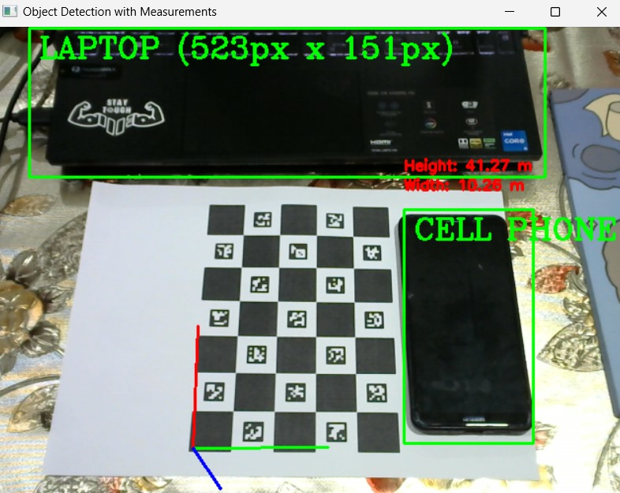

# object-measure

## Object Measurement Using ChArUco Boards
  🔗 Here is the website I refer **[Detection of ChArUco Boards](https://docs.opencv.org/4.x/df/d4a/tutorial_charuco_detection.html)**

This project aims to measure real-world objects using a ChArUco board for calibration. It currently requires a fixed camera angle and the presence of a real object within the same frame to accurately convert pixel measurements to real-world units (meters/centimeters).

### Key Features:
- **ChArUco Board Calibration:** Uses the ChArUco board for camera calibration and object measurement.
- **Real-Time Measurement:** Captures the object along with the calibration board in a single frame to determine the pixel-to-real-world conversion factor.

### Known Limitations:
- **Fixed Camera Angle:** The camera must be fixed at a consistent angle to ensure accurate measurements.
- **Calibration with Real Object:** A real object must be present in the same frame as the ChArUco board to correctly measure pixel-to-meter or pixel-to-centimeter ratios.

### Future Improvements:
- Automating the adjustment for camera angle changes.
- Enhancing the calibration to improve measurement accuracy.

### Example Result:
Below is an example of a measurement output using the current version of the code (not yet fully perfected):

